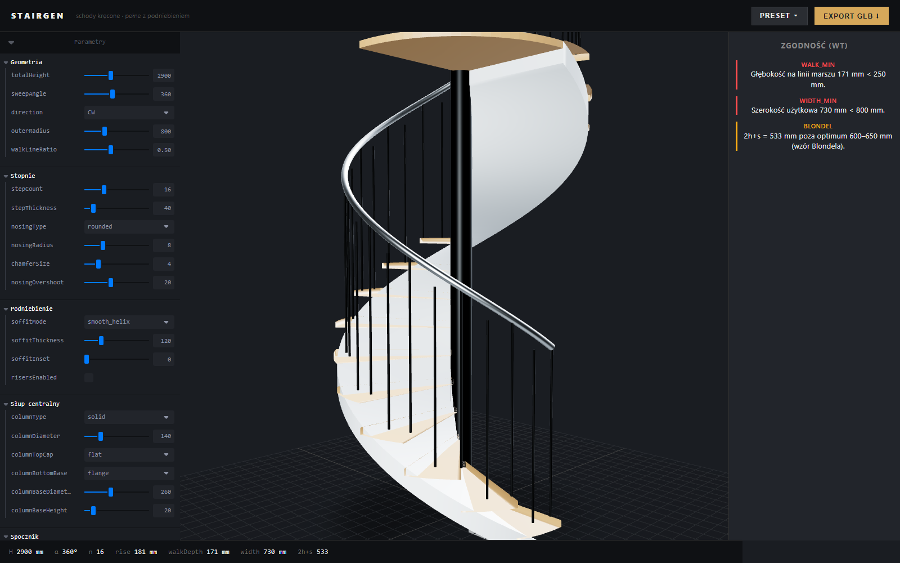
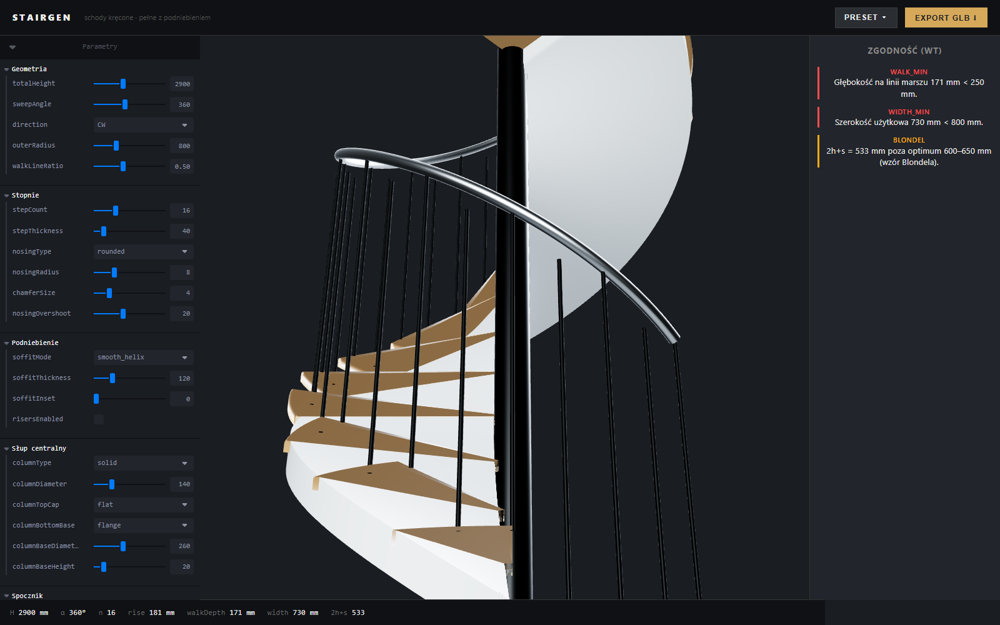

# Stairgen

> Browser-based parametric configurator for solid-tread spiral stairs with a continuous soffit. Built with React Three Fiber. Exports to glTF 2.0 with full PBR materials and round-trippable configuration metadata.



## Overview

Stairgen focuses on one stair typology: the **spiral stair with solid treads and a continuous helical soffit** — the monolithic concrete, bent-laminated timber, and cut-stone forms specified by interior architects. You adjust ~65 parameters across geometry, materials, and scene. The 3D view updates at 60 fps, a live validator flags deviations from Polish building code (*Warunki Techniczne* §68) with three building profiles, and one click exports a production-ready GLB with PBR materials.

## Features

**Parametric geometry**
- Total height, sweep angle (90°–720°), direction, outer radius, walkline ratio
- Step count, thickness, nose profile (square / rounded / chamfer), overshoot, edge rounding
- Three soffit modes: `stepped` with risers, continuous `smooth_helix`, `offset_slab` — matches real realization types (stepped slab, bent-laminated timber, monolithic concrete)
- Central column (solid / tube / none) with dome / spike / flange / plinth caps and bases
- Top landing: quarter / half / square
- Balustrade: vertical bars, horizontal bars, tempered glass, tensioned cables, or solid panels
- Helical handrail with round / oval / rectangular / flat cross-section

**Materials & scene**
- Per-element PBR: steps, soffit, column, bars, handrail, landing, glass
- 12 material presets (oak, walnut, concrete, marble, steel, brass, lacquered white)
- 5 HDRI environments (studio, showroom, interior warm/cool, dusk)
- 5 camera framings (hero, top, elevation, detail, underside)
- Real-time contact shadows

**Compliance**

Live validator with per-rule thresholds for three building types:

| Rule | Residential | Public | Auxiliary |
|---|---|---|---|
| rise max | 190 mm | 175 mm | 220 mm |
| walkline depth min | 250 mm | 300 mm | 200 mm |
| effective width min | 800 mm | 1200 mm | 600 mm |
| railing height min | 900 mm | 1100 mm | 900 mm |
| baluster spacing max | 120 mm | 120 mm | 200 mm |
| Blondel (2h + s) | 600–650 mm | 600–650 mm | info |
| step angle max | 30° | 30° | 45° |

**Export**
- glTF 2.0 binary (GLB) with PBR materials
- Scaled to meters (app works in millimeters internally)
- Full configuration embedded in `asset.extras.stairgenConfig` for round-trip
- Verify at <https://gltf-viewer.donmccurdy.com/>

**Presets**
1. Residential concrete Ø140 — smooth helix, anthracite concrete, glass balustrade, inox handrail
2. Residential oak Ø160 — offset slab, natural oak, round bars, oval oak handrail
3. Loft steel Ø120 — stepped with risers, black steel, tensioned cables
4. Public concrete Ø180 — 450° sweep, grey concrete, dual-side railing, 1100 mm handrail
5. Premium marble Ø150 — white marble, glass panels, brass handrail, showroom HDRI

## Quick start

Requires Node.js 18+.

```bash
git clone https://github.com/przemeknowak781/Stair-Generator-ThreeJS.git
cd Stair-Generator-ThreeJS
npm install
npm run dev
```

Open <http://localhost:5173>. Adjust parameters in the left panel — the scene updates live. Click **Export GLB** to download the model.

## Scripts

| Script | Description |
|---|---|
| `npm run dev` | Start Vite dev server with HMR |
| `npm test` | Run the Vitest suite (62 tests) |
| `npm run build` | Production build into `dist/` |

## Tech stack

- [Vite](https://vite.dev/) 8 — dev server and bundler
- [React](https://react.dev/) 19 + [TypeScript](https://www.typescriptlang.org/) 5 in strict mode (`noUncheckedIndexedAccess`, `exactOptionalPropertyTypes`, `erasableSyntaxOnly`)
- [three.js](https://threejs.org/) 0.183 + [`three-stdlib`](https://github.com/pmndrs/three-stdlib) for `GLTFExporter` and `mergeBufferGeometries`
- [React Three Fiber](https://r3f.docs.pmnd.rs/) + [drei](https://github.com/pmndrs/drei) — declarative 3D scene
- [Zustand](https://github.com/pmndrs/zustand) — single-store state
- [leva](https://github.com/pmndrs/leva) — control panel
- [Vitest](https://vitest.dev/) — unit testing

## Project structure

```
src/
├── config/       types · defaults · computed metrics · validators · 5 presets
├── geometry/     builders: step wedges, soffit (3 modes), column,
│                 balustrade, helical rail, landing, materials
├── scene/        R3F components: Stair composition, Environment (HDRI),
│                 Camera rig, ExportListener
├── ui/           Topbar, ControlPanel (leva), ValidationPanel,
│                 StatusBar, PresetPicker, ExportButton
├── export/       exportSceneToGLB — GLTFExporter + custom extras injection
└── store/        useStairStore (zustand: update · applyPreset · reset)
```

- Design notes: [`docs/plans/2026-04-15-spiral-stair-configurator-design.md`](docs/plans/2026-04-15-spiral-stair-configurator-design.md)
- Implementation plan: [`docs/plans/2026-04-15-spiral-stair-configurator.md`](docs/plans/2026-04-15-spiral-stair-configurator.md)
- QA checklist: [`docs/qa-checklist.md`](docs/qa-checklist.md)

## How it works

### Geometry pipeline

Every mesh is produced by a pure builder in [`src/geometry/`](src/geometry/) that takes the current `StairConfig` and returns a `BufferGeometry`. Builders use direct vertex/index construction rather than CSG — this yields clean topology for PBR UV mapping and avoids brittle boolean-operation edge cases.

The smooth-helix soffit is the most interesting builder: two parallel rings of vertices (top and bottom shells) are swept along a helix, stitched into four face strips (top, bottom, inner, outer), and closed with end caps. Corner vertices are duplicated between shell and wall groups so `computeVertexNormals()` does not average across hard edges. Triangle winding is sign-aware so normals stay correct for both CW and CCW spirals — a lesson learned when the first cut had inverted windings for the default CW direction.

### State and reactivity

A single Zustand store holds one `StairConfig`. leva `onChange` handlers call `store.update(patch)`. Each scene component subscribes to the slice it needs and memoizes its geometry with a dependency list scoped to the fields that actually affect it — changing a material color does not rebuild meshes, changing `stepCount` rebuilds only the steps.

### Export

[`src/export/exportGLB.ts`](src/export/exportGLB.ts) clones the `<Stair>` group, scales by 0.001 (mm → m), passes it through `GLTFExporter`, then re-parses the GLB's JSON chunk to inject `asset.extras.stairgenConfig` with the full configuration. The binary chunk is spliced back with correct 4-byte padding and returned as a `Blob`.



## Roadmap

- Drag-and-drop JSON configuration import
- PBR texture maps (oak / concrete / marble) with `textureScale`
- Draco mesh compression on export
- PNG screenshot export at preset resolutions
- 2D plan + section SVG export with dimensioning
- Accessibility profile (PWD / ADA thresholds)
- Multi-run stairs, winders, landings between runs
- "Unfold" animation for presentation

## License

[MIT](LICENSE) © 2026 Przemek Nowak

## Acknowledgments

Built with the [Poimandres](https://github.com/pmndrs) stack (`@react-three/fiber`, `drei`, `zustand`, `leva`). Validator thresholds sourced from the Polish *Warunki Techniczne* §68.
